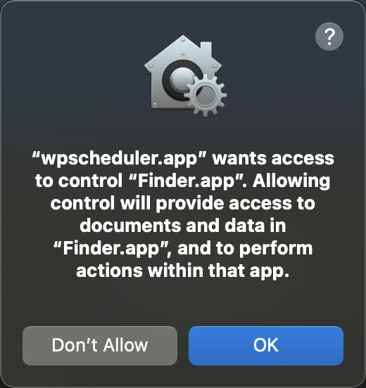
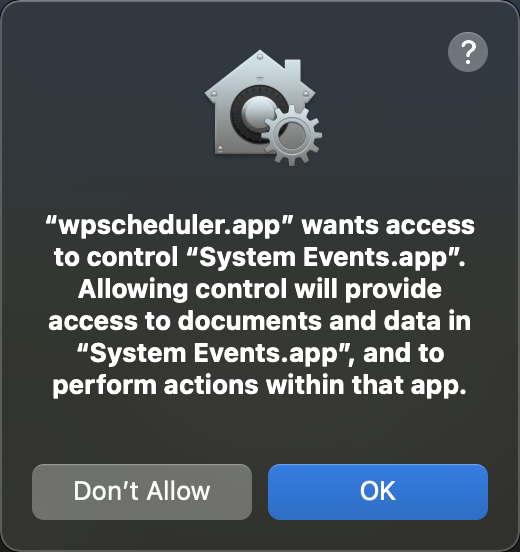

# Wallpaper Scheduler

The idea of this small project is because the IT department of my company resets my laptop wallpaper randomly and frequently. Writing a go app is definitely not the most straight forward solution. People can use cronjobs, Automator workflows, systemd, etc. to solve the problem. The   

## Permission requirement

## Next step
0. tests!
1. customize/select desktop pictures
2. support on other platforms
3. customize the way of switching selected pics. e.g. constant/random time interval; dynamic wallpaper with a cycle of a month, etc. 
4. benchmark the performance, imagine changing pics 10 times/second lol

